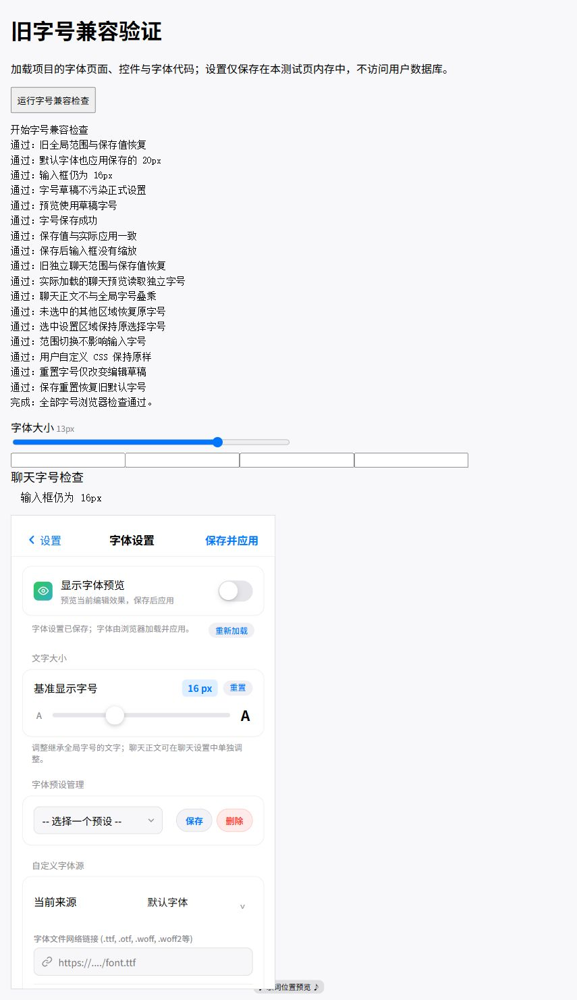

# 旧版兼容修复与验证记录

日期：2026-10-05。修复分支：`codex/restore-pre102-compatibility`。

本次工作以修复前的 `b2ac589` 为项目基准，对明确要求恢复的字号行为使用 10.2 前的 `051ef12` 作比较。保留当前数据库、用户数据及其他功能；没有将整份项目降级。

## 已修复的行为

### 1. 恢复旧字号控制与保存值

- 全局字号恢复 10～28、默认 16；聊天独立字号恢复 12～20、默认 13。
- 全局字号使用旧版的继承方式设置区域根节点，不扫描样式表、不改写所有固定字号、不监听页面节点变化。聊天正文使用保存的 `chat.settings.fontSize`。
- 原来固定为 16px 的聊天输入框继续为 16px，全局选择 10px 或 24px 都不会连带缩放输入框。保留用户自定义 CSS 的优先级。
- 恢复聊天设置里的滑块、数字反馈、预览和保存事件；切换聊天时读取各自保存的字号。
- 字体来源、本地上传、预览草稿、保存失败保护、未保存退出提醒和按范围应用沿用现有实现。编辑草稿时不写入正式设置；保存成功后才应用。
- 保存值、完整字体预设和旧链接预设保留有效字号。旧链接预设继续只替换来源，保留当前字号及范围。

10.4 的归一化曾把有效的 `globalFontSize` 固定为 16，并把聊天显示固定为 13。本次修复停止覆盖有效保存值。如果用户的旧值已经被先前版本写成 16，代码无法推断原来选择多少；可以重新选择，或从保留旧值的备份恢复。

相关实现：`modules/data/custom-fonts.js`、`modules/chat/interface-core.js`、两个原有设置预览模块、`modules/settings/font-presets.js`、两个 HTML 源片段及两个事件绑定源片段。没有调整其他 UI 区域。

### 2. 限制新渲染器编译缓存的保留容量

原编译缓存只限制 300 条，每条配置的指纹可以包含较大的测试样本等数据。现在同时限制 300 条和按字符估算的 2 MiB 配置键、表达式及模板容量；超过容量时淘汰最早条目，单条超限时正常执行但不缓存。

此容量是 UTF-16 字符长度估算，**不是整个 JavaScript 堆或页面内存的上限**。没有更改规则匹配、替换顺序、结果、作用范围和随机行为。现有结果缓存及 Worker 超时保护保持原状。

相关实现：`modules/rendering-rule-engine.js`。

### 3. 通话朗读队列释放无关历史引用

原队列保存整个 `chat` 的浅拷贝，因而会引用聊天历史和长期记忆。现在只保留朗读所需的设置及动作过滤配置，继续冻结语言策略，保留播放顺序、原角色音色及取消行为。

没有删除或改变聊天记录、记忆、音频保存与数据库配置。MiniMax 和 ElevenLabs 均有回归覆盖。

相关实现：`modules/tts-audio.js`。

这两项是已确认的资源保留问题，**不能据此认定它们就是所有用户闪退的原因**。

## 保留行为核对

- 正文复制函数与 `051ef12` 的实现一致，本次没有修改复制模块。仍在点击任务内直接写剪贴板，不等待新渲染器或数据库。
- 数据库 schema、设置存储、渲染运行时、语音服务接口、外观导入导出和 Service Worker 源码与 `b2ac589` 一致。
- 没有回退数据库版本、清空数据、重置所有设置或自动禁用其他新功能。
- 保留现有无规则直通、Worker 超时终止、结果缓存、尾部历史更新、聊天滚动及页面离开清理等修补。
- 构建仍使用原脚本。生成文件中的发布版本号变化用于保持同一批资源一致，不代表那些页面的行为被重新设计。

## 验证结果

| 验证 | 结果与范围 |
| --- | --- |
| 自动测试 | 243 项通过，0 失败、0 跳过；覆盖字体保存/恢复/失败、聊天切换/滚动、渲染、复制、双语与朗读等 |
| 构建 | `npm run build` 成功；4 个脚本束、21 个 HTML 片段生成 |
| 生成一致性 | `npm run check:structure` 通过 |
| 字号浏览器页 | 17 项检查通过：默认字体应用保存字号、草稿与正式设置分离、范围切换、聊天独立字号、输入框固定字号、自定义 CSS 与重置 |
| 聊天浏览器页 | 26 项检查通过：长短聊天、编辑/撤回、页面返回、历史加载和搜索定位、返回最新 |
| 真实 Worker 与 IndexedDB | 无规则直通、旧规则结果、新正则、失控正则终止保留原文、设置保存及事务中止保护通过 |
| 复制浏览器检查 | 点击时用户手势有效，剪贴板写入 Promise 成功；工具的虚拟剪贴板未收到浏览器系统剪贴板数据，未验证真实粘贴。内容及同步调用路径由自动测试核对 |
| PWA 资源检查 | Service Worker 安装并激活，327 个完整缓存资源；发布版本 `83784792c762a789f975` |
| 实际入口 | 构建后的入口到达原登录页面；没有输入账号、调用付费接口或访问真实用户数据 |

浏览器使用本地独立测试来源。字号和聊天页在内存中模拟设置/聊天；存储测试只访问 `ephone-performance-smoke` 测试库。没有将桌面浏览器的窄区域检查当成手机真机验证。

测试过程中，先手工安装测试 PWA 再打开完整本地入口，触发原有本地开发逻辑清理本应用缓存，首次片段读取失败；刷新后正常到达登录页。该测试顺序会相互干扰，重测应先验证完整本地入口，再单独验证 PWA 安装，或使用独立来源。本次没有修改本地缓存清理或加载器。

字号验证截图：



### 重跑方式

```powershell
npm run build
npm run check:structure
$testFiles = @(Get-ChildItem -LiteralPath tests -Filter '*.test.js' | ForEach-Object { $_.FullName })
node --test --test-reporter=tap @testFiles
```

用静态服务器提供项目根目录后，在浏览器打开：

- `/tests/fixtures/font-compatibility-smoke.html`
- `/tests/fixtures/chat-scroll-smoke.html`
- `/tests/fixtures/performance-smoke.html`

点击各页测试按钮。测试页不加入正式应用入口或发布资源清单。

## 提交与局部撤回

- `fe8facb`：恢复字号行为与相关验证。
- `65e211f`：编译缓存容量限制与相关验证。
- `cf8dc3f`：朗读队列释放历史引用与相关验证。
- 后续构建提交：同步生成资源及本记录。

前三项按问题分别提交，最终分支包含配套构建文件。若需撤回其中一项，应在工作分支撤回对应源提交，重新运行 `npm run build`、相关测试及一致性检查，再提交新的生成文件。中间的源提交不是可直接部署的完整资源快照。不要为撤回源码降级用户数据库或删除浏览器数据。

## 尚未完成的真实设备验证

没有真实 iPhone/Android 浏览器和主屏幕 PWA 的崩溃日志，也没有用户反馈中的可重复操作步骤。当前没有证据证明所有闪退均已解决。

上线前仍需使用报错设备和相同数据规模核对：输入法唤起/收起、长聊天连续进入/离开、规则开关、连续通话播放、记忆提取、后台恢复及旧缓存更新。区分页面报错、重载、浏览器进程退出与系统因内存杀进程；记录机型、系统、浏览器/PWA、最后操作及错误日志。根据复现证据继续做局部修复，保留原有默认行为和用户数据。
